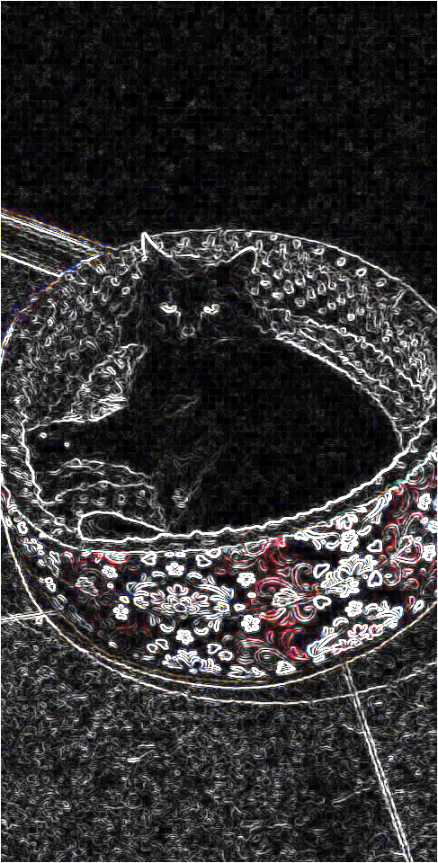

# ImagesTransformator
A simple C++ program used to transform images.
## How to transform
- Put a source image to /gfx directory
- Launch ImagesTransformator and choose correct format & transformator
- Set the source image name
- Load the source
- Set a transformed image name
- Transform
- Get the transformed image from /newGfx directory
## Examples of usage

## Development Possibilities
- [] Add new images formats
- [] Add or update operators
## License
Distributed under the MIT License. See 'LICENSE.txt' for more information.
## Your ideas
:envelope_with_arrow: If you have any ideas for new features, feel free to create a pull request or issue.